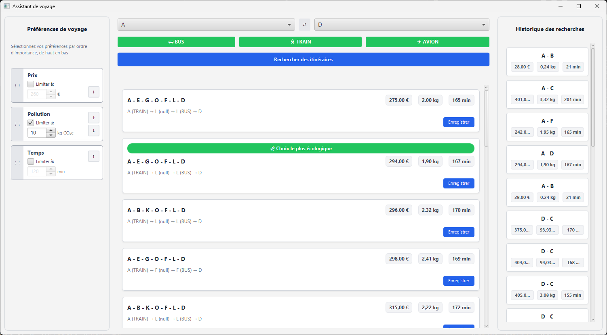

# Rapport IHM - SAÉ 2.01 & 2.02 : Comparaison d'itinéraires de transport

**Équipe B5 :**

- CY

---

## Explication de la SAÉ

Dans cette SAÉ, le but est de créer un assistant personnel de voyage. C'est un logiciel qui doit calculer, afficher et comparer des itinéraires sur un réseau de transport multimodal (avec des bus, des trains et des avions). Pour chaque trajet, on doit calculer un coût qui prend en compte le prix en euros, le temps en minutes et les émissions de gaz à effet de serre.

Pour la partie de l'IHM (Interface Humain-Machine), notre travail consiste à concevoir une interface claire pour que l'utilisateur puisse faire ses recherches facilement. L'application doit permettre de :

- Saisir une ville de départ et une ville d'arrivée sans faire d'erreur.
- Choisir ses préférences entre le prix, le temps et la pollution.
- Afficher les résultats des itinéraires de façon simple et compréhensible.
- Voir l'historique de ses anciens trajets.
- Proposer des éléments de "nudging" pour inciter l'utilisateur à choisir des trajets plus écologiques.

---

## Maquette basse fidélité

Dans cette partie, on présente nos choix de design, le fonctionnement général de l'application et à quoi elle va ressembler.

Pour le design, on a choisi de couper l'écran en trois grandes zones verticales. Cela permet à l'utilisateur de comprendre tout de suite comment interagir avec le logiciel sans être perdu.

Voici les explications détaillées de chaque partie de notre maquette :

- **La partie gauche (Priorités et Bornes) :** C'est ici que l'utilisateur choisit l'ordre de priorité de ses valeurs à optimiser (le prix, l'écologie ou le temps). Il peut aussi définir un maximum ou des bornes à ne pas dépasser pour ses critères (par exemple : pas plus de 10 kg de CO2 ou moins de 300 minutes).
- **La partie droite (Historique) :** Cette zone est dédiée à l'historique des choix de l'utilisateur pour qu'il puisse revoir ses anciens trajets.
- **La partie centrale (Recherche et Résultats) :** C'est le cœur de la page, elle est divisée en trois morceaux de haut en bas :
  - *En haut :* La sélection de la ville de départ et de la ville d'arrivée, avec un bouton au milieu pour inverser facilement le sens du voyage.
  - *Au milieu :* Les filtres pour activer ou désactiver les moyens de transport autorisés ou interdits (Bus, Train, Avion).
  - *En bas :* La zone d'affichage des résultats obtenus. Si aucun trajet ne correspond, un message s'affiche.

### Lien vers la maquette interactive Figma

Pour tester les boutons et voir comment on passe d'un écran à l'autre en mode présentation, notre projet est disponible directement sur Figma:

- **Lien du prototype :** [Cliquez ici pour ouvrir la maquette Figma](https://www.figma.com/design/3IvCsGe2PwgHD5a1Am4iZk/IHM?node-id=0-1&t=LqN4CF0COp3LK9jI-1)

---

## Maquette haute fidélité et Implémentation JavaFX

Pour le développement final sous JavaFX, nous avons transformé notre maquette basse fidélité en une interface fonctionnelle, en utilisant une `BorderPane`.

### La gestion multicritère (Version 3)

Conformément aux exigences de la version 3, l'utilisateur ne choisit plus un seul critère, mais exprime ses préférences **de manière relative**.
Dans le volet de gauche, nous avons implémenté des **text field** couplés à des Spinners pour définir la limite (les bornes) du Prix, du Temps et du CO2.

### L'affichage des résultats en "Cartes"

Les itinéraires trouvés s'affichent au centre sous forme de "Cartes" stylisées. Pour une lisibilité immédiate, les coûts de chaque trajet sont isolés dans des "badges" (petites boîtes à fond gris). Les villes de correspondances inutiles sont masquées pour ne montrer que l'essentiel à l'utilisateur (Ville de départ -> Ville d'arrivée).

### L'Historique persistant

Le volet de droite affiche les trajets sauvegardés par l'utilisateur. En cliquant sur "Enregistrer" sur une carte de résultat, le trajet est sérialisé en binaire dans le fichier `historique.sae` et apparaît instantanément à droite sous forme de mini-carte résumée, montrant l'évolution des choix de l'utilisateur.

---

## Justification des choix ergonomiques (Critères de Bastien et Scapin)

Afin de répondre aux besoins métiers et d'offrir la meilleure expérience utilisateur possible, notre interface a été pensée autour des critères ergonomiques de Bastien et Scapin.

- **Guidage (Incitation / Nudging) :** Pour inciter l'utilisateur à adopter des comportements écoresponsables, nous avons mis en place un système de "Nudging" visuel très fort. Le trajet générant le moins de CO2 reçoit automatiquement un **badge vert** "Choix le plus écologique". À l'inverse, si un trajet dépasse un certain seuil de pollution (ex: utilisation de l'avion), son indicateur de CO2 devient rouge et une alerte "Fort impact carbone" s'affiche.
- **Prévention des erreurs :** La sélection des villes se fait via des menus déroulants (`ComboBox`) pré-remplis avec les données du réseau, rendant impossible les fautes de frappe. Si l'utilisateur tente de rechercher un trajet avec la même ville de départ et d'arrivée, un message d'erreur rouge explicite s'affiche et bloque la recherche.
- **Signifiance des codes et dénominations :** Nous utilisons des codes couleurs évidents (les boutons de transport deviennent verts quand ils sont actifs, et rouges quand ils sont exclus). Le bouton d'inversion des villes utilise le symbole _fleche dans les 2 sens_ compris de tous.
- **Contrôle utilisateur et Flexibilité :** L'utilisateur garde le contrôle total : il peut redimensionner la fenêtre sans casser l'interface (grâce aux `ScrollPane` et aux redimensionnements dynamiques `Priority.ALWAYS`). De plus, après avoir enregistré un trajet, le bouton change d'état ("Enregistré") et se désactive pour éviter les clics multiples (retour d'information immédiat).

---

## Répartition des tâches au sein de l'équipe

Pour mener à bien ce projet dans les délais impartis, nous avons adopté une démarche collaborative où chacun a pu apporter son expertise à différentes étapes du développement :

- **Romain LEFEBVRE :** Réalisation de la maquette interactive sur Figma, conception de l'interface graphique via Scene Builder et création de l'architecture de base de l'application.
- **Kylian PLANTARD et Youssef CHEKALIL :** Adaptation et développement du code Java pour répondre aux nouveaux besoins de la SAÉ (évolution de la logique, implémentation des fonctionnalités avancées et gestion dynamique du contrôleur).

Enfin, nous avons travaillé tous ensemble lors de la phase d'intégration pour relier parfaitement notre interface graphique (IHM) à notre logique (POO), ce qui nous a permis d'aboutir au rendu final suivant :

**Démonstration vidéo :**
Pour voir notre application complète en action et découvrir toutes ses fonctionnalités (drag & drop, historique, nudging), vous pouvez visionner notre vidéo de démonstration de 3 minutes en cliquant sur le lien ci-dessous :

- [Cliquez ici pour visionner la vidéo de présentation](https://drive.google.com/drive/folders/1AIuE8Jr1Gw1bOvzeKZaXp8vozjUiqu4o?usp=sharing)
