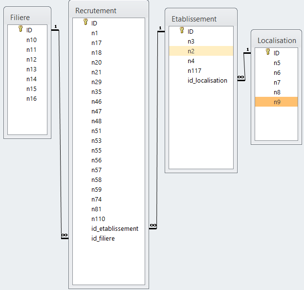

# Comprendre les données

> Dans cettte partie, nous allons, comme indiquer dans le titre, nous allors comprendre les données. Nous allons dans une première partie analyser le fichier récupérer, ici le fichier de parcoursup, puis nous allons importer les données, tout cela en vous indiquant comment nous avons fait.

## Analyse du fichier récupéré

1. **Combien y-a t-il de lignes ?**  
    
    > Dans ce fichier, il y a 14253 lignes, nous avons utilisé cette commande:
    >
    > ```sql
    > wc -l fr-est-parcoursup.csv
    > ```

1. **Que représente une ligne ?** 

    > Une ligne correspond à une formation précise proposée par un établissement pour une année donnée. 
    > 
    > Elle contient des informations générales sur l’établissement (nom, localisation, statut) ainsi que sur la formation (type, spécialité, sélectivité) ainsi que des données statistiques sur les candidats, comme leur nombre, leur profil (bacheliers généraux, technologiques, professionnels) ou leur statut (boursiers, etc.) et présente les résultats d’admission, avec le nombre d’admis et plusieurs indicateurs permettant d’analyser l’accès à la formation.

1. **Combien y-a t-il de colonnes ?** 

    > Il y a 118 colonnes, nous avons utilisé cette commande:
    >
    >```
    > head -1 fr-est-parcoursup.csv | tr ';' '\n' | wc -l 
    >``` 
    >
    > Le fichier fr-est-parcoursup.csv est le fichier que nous avons récupéré sur parcoursup.


1. **Quelle colonne identifie un établissement ?** 
    
    > La colonne identifiant un établissement est la colonne Code UAI de l'établissement (n3), cependant, si on veut le nom en clair, il faut se référer à la colonne Établissement (n4)

1. **Quelle colonne identifie une formation ?**

    > La colonne identifiant une formation est la colonne cod_aff_form (n110)

1. **Comment repérer notre BUT Informatique ?** 

    > Afin de repérer notre BUT Informatique, il nous suffit d'utiliser cette commande:
    >
    >`grep "BUT - Informatique" fr-esr-parcoursup.csv | grep -i "Lille"`

1. **Quelle colonne identifie un département ?** 

    > La colonne identifiant un établissement est la colonne Code départemental de l’établissement (n5), cependant, si on veut le nom en clair, il faut se référer à la colonne Département de l’établissement (n6)

1. **Comment envisagez vous importer ces données ?** 

    > Pour importer ces données, on ensisage de créer une table avec 118 colonnes puis importer les données dans cette table.

1. **Quels problèmes identifiez vous dans ces données initiales**

    > La première ligne du fichier initial nous permet d'avoir le nom des tables, cependant nous pouvons pas les importer dans nos tables, il faudra donc supprimer la première ligne
    > 
    > Il y a énormement de redondances dans le fichier
    >
    > De nombreuses colonnes contiennent des valeurs NULL
    >
    > Les noms de colonnes sont trop longs, et rends le fichier illisible

## Importer les données

> Afin d’apporter un fichier dico.xls permettant la correspondance entre les numéros de colonnes et les noms du fichier initial, nous avons copié la première ligne du fichier de base, puis sur LibreOffice Calc, on a fait un Ctrl + Maj + V, qui permet d’importer des données, nous avons choisi “Utiliser le dialogue d’importation de texte” qui prend donc ce que vous avez copier, puis nous utiliser comme séparateur des ; . Cependant il nous le met sur une ligne, et afin d’avoir une meilleur visibilité, nous avons choisi de le mettre en colonne. Pour cela, nous avons copier l'entièreté de la première ligne, puis nous avons une nouvelle fois utiliser  Ctrl + Maj + V ici qui permet de faire un collage spécial, et enfin, nous avons cliquer sur la première case puis choisi l’option transposer qui permet de transposer les données. 
>
> Ensuite nous avons vu qu'une commande peut tout faire d'un coup, voici la commande
>
> `head -1 fr-esr-parcoursup.csv | tr ';' '\n' | nl -ba > dico.txt`
>
> Si vous voulez rajouter un colonne avec pour ligne n1, n2, n3... Vous pouvez mettre dans la première ligne n1, puis vous glissez vers le bas.
>
> Nous allons nous données les données nécessaire afin de créer la table import, qui sera la table avec toutes les données ainsi que fournir quelques requêtes en s'appuyant sur la table import.
>
> Voici le code pour la création de la table import:
>
>```sql
>CREATE TABLE import (
>    n1 INT, n2 TEXT, n3 CHAR(8), n4 TEXT, n5 CHAR(3), n6 TEXT, n7 TEXT, n8 TEXT,
>    n9 TEXT, n10 TEXT, n11 VARCHAR(50), n12 TEXT, n13 TEXT, n14 TEXT, n15 TEXT,
>    n16 TEXT, n17 TEXT, n18 INT, n19 INT, n20 INT, n21 INT, n22 INT, n23 INT, n24 INT, n25 INT, n26 INT, n27 INT,
>    n28 INT, n29 INT, n30 INT, n31 INT, n32 INT, n33 INT, n34 INT, n35 INT, n36 INT, n37 INT, n38 INT, n39 INT, n40 INT, n41 INT,
>    n42 INT, n43 INT, n44 INT, n45 INT, n46 INT, n47 INT, n48 INT, n49 INT, n50 INT, n51 INT, n52 INT, n53 INT, n54 INT, n55 INT,
>    n56 INT, n57 INT, n58 INT, n59 INT, n60 INT, n61 INT, n62 INT, n63 INT, n64 INT, n65 INT, n66 INT, n67 INT, n68 INT, n69 INT,
>    n70 INT, n71 INT, n72 INT, n73 INT, n74 FLOAT, n75 FLOAT, n76 FLOAT, n77 FLOAT, n78 FLOAT, n79 FLOAT, n80 FLOAT, n81 FLOAT,
>    n82 FLOAT, n83 FLOAT, n84 FLOAT, n85 FLOAT, n86 FLOAT, n87 FLOAT, n88 FLOAT, n89 FLOAT, n90 FLOAT, n91 FLOAT, n92 FLOAT,
>    n93 FLOAT, n94 FLOAT, n95 FLOAT, n96 FLOAT, n97 FLOAT, n98 FLOAT, n99 FLOAT, n100 FLOAT, n101 FLOAT, n102 TEXT, n103 INT,
>    n104 TEXT, n105 INT, n106 TEXT, n107 INT, n108 TEXT, n109 TEXT, n110 TEXT,
>    n111 TEXT, n112 TEXT, n113 FLOAT, n114 FLOAT, n115 FLOAT, n116 FLOAT, n117 VARCHAR(50), n118 TEXT
>);
>```
>
> Nous avons que les types de colonnes soient les plus restricitfs possible, cependant, il se peux qu'il y es encore plus restrictif, notamment pour les champs de texte assez long.
>
> Une fois la table créer, il faut importer les données dans cette table, voici le code permettant de le faire:
>
>```sql
> \copy import from fr-esr-parcoursup.csv.csv delimiter ';' NULL '';
>```
>

### Voici mainteant quelques requêtes

1. **Combien il y a de formations gérés par ParcourSup ?**

    > Il y a **3150** formations gérés par ParcourSup
    >
    > ```sql
    > SELECT COUNT(DISTINCT n10) FROM import;
    > ```

1. **Combien il y a d’établissements gérés par ParcourSup ?** 

    > Il y a **3707** établissements gérés par ParcourSup
    >
    > ```sql
    > SELECT COUNT(DISTINCT n4) FROM import;
    > ```

1. **Combien il y a de formations pour l’université de Lille ?** 

    > Il y a **99** formations pour l'université de Lille
    >
    > ```sql
    > SELECT COUNT(DISTINCT n10) FROM import
    > WHERE n4 LIKE 'Université de Lille%';
    > ```

1. **Combien il y a de formations pour notre site de IUT ?**

    > Il y a **10** formations pour le site de notre IUT
    >
    > ```sql
    > SELECT COUNT(*) FROM import
    > WHERE n4 = 'Institut universitaire de technologie de Lille - 
    > Université de Lille';
    > ```

1. **Quel est le code du BUT Informatique de l’unversité de Lille ?**

    > Le code du BUT Informatique de l'université de Lille est **0597215X**
    >
    > ```sql
    > SELECT DISTINCT n3 FROM import
    > WHERE n4 = 'Institut universitaire de technologie de Lille - 
    > Université de Lille' AND n10 LIKE '%Informatique%';
    > ```

1. **Citez 5 colonnes contenant des valeurs nulles**

    > On à pas trouver de requete pour le faire en une seule fois, donc on a du tester un par un... 
    >
    > Le `COUNT(*)` compte toutes les lignes, mêmes les NULL, tandis que le `COUNT(n1)` ne compte pas les NULL, donc si le résultats est supérieur à un, ça veut dire que la colonne contient des valeurs nulles
    >
    > ```sql
    > SELECT COUNT(*) - COUNT(n1) FROM import;
    > ```
    >
    > Voici 5 colonnes avec des valeurs null:
    > * n118
    > * n117
    > * n111
    > * n3
    > * n16

# Ventiler les données

## MCD & script

> Maintenant que nous avons récupérer toutes les données dans une seule table, il faut ventiler les données afin de réduire les redondances et de faciliter également les requêtes et améliore la maintenabilité de la base.
>
> Voici le MCD
>
>{width=15cm height=10cm}
>
> Dans le fichier parcourssup.sql, vous trouverez toutes les actions d'importations et de création/remplissage des tables.
>
> Nous précisons aussi que nous avons mis un index car sinon la requête prennait pas mal de temps, et comme vu dans nos cours, Un index permet d’accéder rapidement aux donnée.

## Une question de taille

1. **Quelle taille en octet fait le fichier récupéré ?**  

    > Le fichier récupéré fait *12 878 288* octets
    >
    > `wc -c fr-esr-parcoursup.csv` où 'fr-esr-parcrousup.csv' est le fichier récupérer.

1. **Quelle taille en octet fait la table import ?**

    > La table import fait *16 777 216* octets
    >
    > ```sql
    > pg_size_pretty(pg_total_relation_size('import'));
    > ```

1. **Quelle taille en octet fait la somme des tables créées ?**

    > La somme des tables créer fait *5 832 704* octets
    >
    > ```
    > SELECT pg_size_pretty(pg_total_relation_size('import') + pg_total_relation_size('recrutement') + pg_total_relation_size('etablissement') + pg_total_relation_size('localisation') + pg_total_relation_size('filiere'));
    > ```

1. **Quelle taille en octet fait la somme des tailles des fichiers exportés correspondant à ces tables ?** ......

    > La somme des tailles des fichiers exportés fait *4 091 147* octets
    >
    > `wc -c etablissement.csv localisation.csv filiere.csv  recrutement.csv` où les quatres noms de fichiers sont nos tables exportés.


> Pour ce qui est des requête ici, nous avons trouver sur la [documetation](https://docs.postgresql.fr/18/pg18.pdf) commment avoir les tailles. Vous pouvez directement aller voir les pages 452 et 453.

> Pour ce qui est d'exprotés les données, nous avons utilisé la commande `\copy (nom de la table) TO '(nom du fichier).csv' WITH (FORMAT CSV, DELIMITER ';', HEADER);`
>
> Nous avons mit HEADER qui permet de savoir ce qu'est une colonne, la première ligne permet donc d'avoir la correspondance des données, donc les tailles de nos fichier seront un peu plus grandes que seulement les données.

# Requêtage

> Dans le fichier requetes.sql, vous trouverez toutes les requêtes ainsi que ce qu'elle donne, cependant, ici, nous apporterons quelques infomrations que nous jugerons utiles et explicatif.
>
> De plus, pour trouver leurs re-calcul, nous nous sommes aidés du fichier dico.xls, donc avec les noms des colonnes, nous avons pu voir leurs correspondances.
>
> * Q3: Ecrire une requête qui, à partir de import affiche le contenu de la colonne n74 et le re-calcul de celle-ci à partir d’autres colonnes de import (2 cols)
>
> Dans cette requête, le WHERE sert à enlever tout les n47 qui sont à 0, car comme vous devriez le savoir, les divisions par 0 sont impossible.
>
> Nous avons aussi du mettre ::NUMERIC qui force PostgreSQL à faire une division décimale plutôt qu'entière. Sans cela, toutes les valeurs sont à 0.
>
> Nous devons aussi mettre `ROUND` qui arrondi par défaut à 0 décimales, mais après la virgule que nous avons mis, nous pouvons spécifier le nombres de décimales que nous voulons.
>
> Pour ce qui est des questons "*A partir de combien de décimales ces données sont exactes ?*", les données sont directement arrondis. 
>
> Nous avons donc mis les champs en FLOAT, car si on met en NUMERIC, les valeurs sont par exemple *12,0*, et si on arrondis avec une décimal, les valeurs sont pas les mêmes.
>
> Donc la réponse est forcément 0.
>
> Cependant il y a une différence majeur, quand il y a des valeurs à x.5, PostgreSQL les arrondis à 62 mais les données données sont arrondis à 63. 
>
> Donc nous ne pouvons pas garentir à 100% que le re-calcul est bon.


