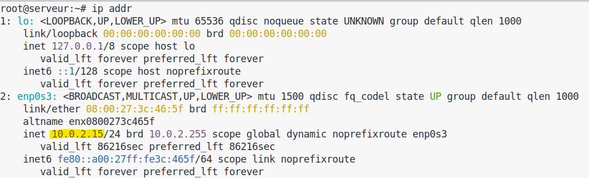
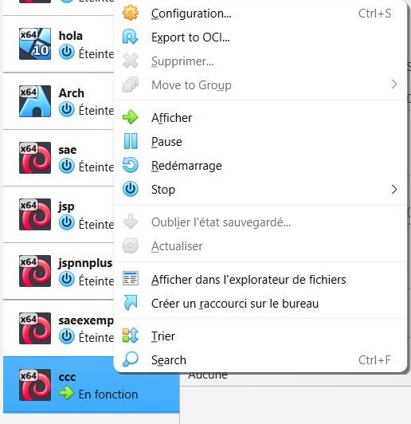

# Préparation d’une machine virtuelle Debian

## Installation d'une VirtualMachine

> Pour ce qui est de l'installation d'une VirtualMachine ou machine virtuelle, vous pouvez aussi vous référencer sur [**ce site**](https://openclassrooms.com/fr/courses/2035806-virtualisez-vos-environnements-de-travail/6313951-creez-une-vm-avec-une-image-disque) qui explique tout aussi bien l'installation d'une VM, même si il utilise une version antérieure.

### Installation d'un Hyperviseur

> Un [**hyperviseur**](https://www.ibm.com/fr-fr/think/topics/hypervisors) est un logiciel qui permet de faire fonctionner des **Machines Virtuelles (VM)**.  
> Mais c’est quoi une **machine virtuelle** ?

> Une machine virtuelle est un **ordinateur simulé à l’intérieur de votre ordinateur**, elle possède son propre système d’exploitation, ses fichiers et ses paramètres.
>
> Ici, nous allons utiliser **VirtualBox**, mais il en existe d'autres comme **VMware Workstation** ou **VMware Player**.  
>Il vous faut donc un **hyperviseur** avant d'installer votre VM, car c’est lui qui va gérer les ressources de votre ordinateur (RAM, processeur, disque).
>
> Pour installer **VirtualBox**, allez sur [ce site](https://www.virtualbox.org/wiki/Downloads) et téléchargez le fichier selon votre **OS (Operating System)**, c’est-à-dire le système d’exploitation de votre ordinateur (Windows, Linux ou macOS).
>
> Nous ferons l'exemple avec **Windows**, mais la procédure est quasiment identique sur les autres systèmes.
>
> Après avoir téléchargé le fichier, **ouvrez-le** puis vous devriez arriver sur cet écran.
>
> { width=400px }
>
> Appuyez sur **suivant**, puis cochez la case **"J'accepte les termes du contrat de licence"**.
>
> Ensuite cliquez sur **suivant** (nous voulons installer toutes les fonctionnalités).  
> Puis cliquez **2 fois sur "Oui"** lorsque Windows vous demande si vous acceptez les modifications.
>
> Pour finir l'installation, **cochez les cases que vous souhaitez** (de préférence toutes) afin de créer des raccourcis vers **VirtualBox** et pouvoir le retrouver facilement.
>
> Cliquez ensuite sur **installer** et attendez quelques instants que l'installation se termine.
>
> Puis cliquez sur **terminer**.
>
> Si tout s'est bien passé, vous devriez arriver sur cette fenêtre :
>
> { width=300px }
>
> Votre installation est maintenant terminée. Nous allons maintenant passer à la **création d'une machine virtuelle**.

---

### Installation d'une VM

> Créer une machine virtuelle est relativement simple, mais cela peut prendre un peu de temps car certains fichiers doivent être téléchargés.
>
> Dans VirtualBox, cliquez sur l'onglet **Machine** en haut à gauche puis sur **Nouvelle**.  
> Vous devriez arriver sur cette fenêtre :
>
> { width=500px }
>
> Entrez un **nom pour votre machine virtuelle** dans **VM Name**.
>
> Pour le système d’exploitation (la case **OS**), nous utiliserons **Linux**, mais VirtualBox permet aussi d’installer d'autres systèmes comme **Windows** ou **BSD**.
>
> Pour la distribution (OS Distribution), nous utiliserons **Debian**, et pour la version (OS Version) **Debian 13 Trixie (64-bit)**.
>
> Cliquez ensuite sur **Finish**.
>
> { width=500px }
>
> Avant d'ouvrir votre VM, vous pouvez changez la configuration de votre VM, c'est à dire la [RAM](#pourquoi-allouer-2048-mo-de-ram-à-la-vm--quest-ce-qui-se-passerait-avec-seulement-512-mo-) ainsi que le processeur. Pour cela il vous suffit d'aller dans l'onglet **configuration** puis **système**, dans **carte mère** vous pouvez changer la RAM et dans [**processeur**](https://fr.wikipedia.org/wiki/Processeur), le nombre de CPU qui fonctionne comme la RAM et permet d'exécuter plus de tâches en même temps.
>  
> Dans le panneau de gauche, vous devriez maintenant voir **votre machine virtuelle apparaître** avec le nom que vous lui avez donné.
>
> Si ce n'est pas le cas, c'est probablement qu'une étape a été mal réalisée (sauf si vous avez déjà d'autres VM).

---

### Installation de l'ISO

> Nous allons maintenant installer le **système d’exploitation dans la machine virtuelle**.
>
> Pour cela, il faut télécharger un **fichier ISO**, qui est une image disque contenant les fichiers nécessaires à l'installation du système.
>
> Téléchargez l’ISO de Debian [ici](https://www.debian.org/download.fr.html) puis **téléchargez le fichier `.iso`** (environ **750 Mo**).
>
> Nous allons ensuite l'insérer dans la VM.
>
> Cliquez sur **Configuration**, puis sur **Stockage**.
>
> { width=400px }
>
> Cliquez sur le **petit disque à droite**, puis sélectionnez le fichier **.iso** que vous venez de télécharger.
>
> Appuyez ensuite sur **OK** en bas de la fenêtre.

### Configuration de la VM

> Nous allons maintenant lancer l’installation du système dans la VM.
>
::: tip
Si vous vous **trompez** sur une de ses étapes, sur certaine étape vous avez `Go Back`, alors vous pourrez aller à **l'étape d'avant**.
:::

> Cependant, sur **certaines étapes** vous ne pouvez **pas revenir en arrière** et donc vous devrez **tout recommencer**, faites bien **attention** et **lisez** bien les **consignes**
>
> Démarrez votre machine virtuelle en cliquant sur **Démarrer**.
>
> Vous devriez arriver sur cet écran :
>
> 
>
> Ici, tout se fait avec les **flèches directionnelles du clavier**.  
> La souris n’est généralement **pas utilisée pendant l'installation**.
>
> Pour valider une option, il faut appuyer sur la touche **Entrée**.
>
> Voici les étapes à suivre :


1. **Choix de l'installation**

    > Ici vous pouvez choisir la méthode d'installation.  
    > Nous allons choisir **Install**, qui correspond à une installation classique.
    >
    > Si, par mégarde, vous vous **trompez**, **éteignez** votre machine en **fermant l'application**

1. **Choix de la langue et de la zone géographique**

    > { width=500px }  
    > { width=500px }
    >
    > Sélectionnez votre **langue** puis votre **zone géographique**.

1. **Choix du clavier**

    > { width=250px }
    >
    > Sélectionnez la **configuration de votre clavier**.  
    > Par exemple :
    >
    > - **Français** pour un clavier **AZERTY**
    > - **Anglais** pour un clavier **QWERTY**

1. **Réseau et domaine**

    > { width=500px }
    >
    >Choisissez un **nom pour votre machine**[^1].  
    >Laissez le **domaine vide**[^2].

1. **Choix du mot de passe root**

    > { width=500px }
    >
    > Saisissez un **mot de passe root**[^3] puis **confirmez-le**.

1. **Création d'un utilisateur**

    > Vous devez créer un **utilisateur principal** pour utiliser la machine.
    >
    > Entrez :
    >
    > - le **nom de l'utilisateur**
    > - son **identifiant**
    > - son **mot de passe** (deux fois)

1. **Partitionnement du disque**

    > Pour simplifier l'installation, nous allons utiliser le **partitionnement automatique**.
    >
    > Choisissez :
    >
    > - `Assisté – utiliser un disque entier`
    > - sélectionnez le disque proposé
    > - `Tout dans une seule partition (recommandé pour les débutants)`
    >
    > Puis sélectionnez :
    >
    > `Terminer le partitionnement et appliquer les changements`
    >
    > Et confirmez par **oui**[^5].

::: warning
Attention, une seule erreur ici et votre VM ne fonctionnera jamais !
:::

1. **Configuration du gestionnaire de paquets**

    > Choisissez **non**, puis nous allons configurer le **miroir Debian**[^6].
    >
    > Sélectionnez votre **pays** (France par exemple) puis choisissez le miroir par défaut :
    >
    > **deb.debian.org**
    >
    > Pour le **mandataire (proxy)**, laissez ce champ **vide**.

1. **Sélection des logiciels**

    > Nous allons installer un **environnement de bureau** pour avoir une interface graphique.
    >
    > Pour **cocher ou décocher une case**, utilisez la **barre espace**, n'**utilsez pas la ~~touche Entrée~~**, sinon vous allez aller directement à l'**étape suivante sans faire de modification**
    >
    > Sélectionnez :
    >
    > - **MATE**
    > - **Serveur web**
    > - **Serveur SSH**
    >
    > Et **décochez GNOME**.
    >
    > 

1. **Installation de GRUB**

    > Pour la dernière étape, l’installateur vous demandera si vous voulez installer **GRUB**[^7].
    >
    > Choisissez **oui**, puis sélectionnez **/dev/sda**.
    >
    > GRUB est le programme qui permet à votre ordinateur de **démarrer le système d’exploitation installé**.


[^1]: Ce nom sert à identifier la machine sur un réseau.  
[^2]: Le domaine sert à compléter le nom de la machine sur un réseau. 
[^3]: Le compte **root** est l’administrateur du système.  
[^5]: Le partitionnement est une étape importante car il organise le stockage du disque.  
[^6]: Un miroir HTTP est un serveur qui copie les fichiers Debian afin de permettre un téléchargement plus rapide.  
[^7]: GRUB est un chargeur d’amorçage permettant de démarrer un système d’exploitation.

## Configuration matérielle dans VirtualBox

### Que signifie “64-bit” dans “Debian 64-bit” ?
  
  > Dans "Debian 64-bit", [**64-bit**](https://fr.wikipedia.org/wiki/Processeur_64_bits) signifie que le **système d’exploitation** est conçu pour une **architecture processeur 64 bits**. Le processeur peut manipuler des **registres et adresses mémoire sur 64 bits**, ce qui permet de gérer **plus de 4 Go de RAM**. [source](https://www.debian.org/releases/stable/amd64/)

### Quelle est la configuration réseau utilisée par défaut ?

  > La **configuration réseau par défaut** est **DHCP**, ce qui signifie que l’**adresse IP est attribuée automatiquement** par un **serveur DHCP** [source](https://www.virtualbox.org/manual/ch06.html).

### Pourquoi allouer 2048 Mo de RAM à la VM ? Qu’est-ce qui se passerait avec seulement 512 Mo ?

#### Qu'est-ce que la RAM ?

> Tout d'abord, qu'est ce que la RAM. La [**RAM**](https://www.britannica.com/technology/RAM-computing) (Random Access Memory), ou mémoire vive en français, est un composant de l’ordinateur qui permet de **stocker temporairement les données utilisées par les programmes en cours d’exécution**.  
>
> Plus vous avez de RAM, plus votre ordinateur peut **gérer plusieurs tâches en même temps** sans ralentir.  
>
> Contrairement au disque dur, la RAM est une mémoire **temporaire** : toutes les données sont perdues lorsque l’ordinateur est éteint.

#### Pourquoi allouer 2048 Mo de RAM et que se passerait il avec seulement 512 Mo.

> Maintenant que vous savez ce qu'est la **RAM**, on va pouvoir vous expliquer pourquoi **allouer 2048 Mo de RAM**.  
> Si on allouait seulement **512 Mo**, la RAM serait **rapidement saturée** et votre **VM serait beaucoup plus lente**.  
>  
> De plus, il faut savoir que la **RAM que vous allouez à votre VM est prise sur celle de votre ordinateur** ([source](https://www.virtualbox.org/manual/ch03.html#intro-64bitguests), section 3.5.1).  
> Par exemple, si votre ordinateur a **8 Go de RAM** et que vous allouez **6 Go à votre VM**, il ne vous restera plus que **2 Go pour votre PC**, ce qui peut le rendre **lent**.  
>  
> C'est pour cela que nous allouons **2048 Mo**, afin que cela **n'affecte presque pas votre ordinateur** tout en permettant à la **VM de fonctionner correctement**.

### Quel est le mode réseau utilisé par défaut par VirtualBox (NAT, pont, réseau interne…) ?

  > Dans la configuration de base de VirtualBox, le réseau est configuré en NAT ([source](https://www.virtualbox.org/manual/ch06.html), chapitre 6, section 6.3). 

### Quelle est l’adresse IP de votre VM ? Comment l’avez-vous obtenue ?

  >  L'adresse IP est **10.0.2.15**. On l'obtient en tapant la commande `ip addr` et on regarde dans la partie **enp0s3** juste après inet ([source](https://man7.org/linux/man-pages/man8/ip.8.html)).  
  >  
  { width=600px }  
  >
  > Il y a aussi d'autres informations tels que:
  > * le masque qui indique quel est la partie host et quel est est la partie réseau
  > * l'adresse ip de broadcast qui est une adresse spéciale qui permet de contacter tous les appareils sur le meme réseau [source](https://en.wikipedia.org/wiki/Broadcast_address)
  > * l'adresse ip de loopback qui permet à un ordinateur de se connecter lui-même.
  > Nous pouvons obtenir l'adresse ip avec d'autres commandes telles que `ip route` ou encore `ifconfig`.  
  >
  > Cependant, si vous faites la commande `ifconfig`, vous pouvez avoir quelques problèmes notamment le fait que `ifconfig` n'est pas installé comme représenté ci-dessous.  
  
   ```
  Command 'ifconfig' not found, but can be installed with:
  sudo a pt install net-tools
   ```

  > Cependant la solution y est aussi écrit, il peut être installé avec la commande `sudo apt install net-tools`.  
  **Mais que veux dire cette commande ?**  
  Pour ce qui est de `sudo`, aller voir [ici](#quelle-est-la-différence-entre-su-et-sudo-), `apt` est l’outil de gestion de paquets sur les distributions Debian/Ubuntu et `install net-tools` installe le paquet qu'on veut, ici net-tools. 


### Quelle est l’adresse de la passerelle par défaut ? À quoi correspond cette adresse ?

  > L'adresse de la passerelle par défaut est 10.0.2.2 (on l'obtient en faisant `ip route` ([source](https://www.man7.org/linux/man-pages/man8/ip-route.8.html))). Elle correspond à l'adresse du routeur virtuel de VirtualBox qui permet à la VM d'accéder au réseau extérieur.
  
  ```
  default via 10.0.2.2 dev enp0s3 proto dhcp src 10.0.2.15 metric 100
  10.0.2.0/24 dev enp0s3 proto kernel scope link src 100.2.15 metric 100
  ```

## Installation OS de base

### Qu’est-ce qu’un fichier iso bootable ?

  > C'est une image disque contenant tous les fichiers d'un support (DVD, clé USB) et incluant un secteur d'amorçage. Cela permet à l'ordinateur de démarrer directement sur ce fichier pour lancer une installation ou un système "Live" [source](https://en.wikipedia.org/wiki/Optical_disc_image).

### Qu’est-ce que MATE ? GNOME ?
  
  > Ce sont des **environnements de bureau** (interfaces graphiques). **GNOME** est l'interface moderne et riche par défaut sur Debian, tandis que **MATE** est une interface plus traditionnelle, légère et consommant moins de ressources. [source](https://wiki.debian.org/DebianDesktop)


### Qu’est-ce qu’un serveur mandataire ?
  
  > Aussi appelé **Proxy**, c'est un serveur qui agit comme intermédiaire entre un client (votre VM) et Internet. Il est souvent utilisé en entreprise pour filtrer le contenu ou améliorer les performances via un cache. [source](https://en.wikipedia.org/wiki/Proxy_server)


### Qu’est-ce qu’un serveur web ?

  > C'est un logiciel (comme **Apache** ou **Nginx**) qui répond à des requêtes HTTP/HTTPS pour diffuser des pages web ou des données à des clients (navigateurs) [source](https://developer.mozilla.org/fr/docs/Learn_web_development/Howto/Web_mechanics/What_is_a_web_server). 


### Quel logiciel de serveur SSH a été installé ? Comment vérifier qu’il est bien démarré ?

  > Le logiciel installé est **OpenSSH Server**. On vérifie son état avec la commande : `systemctl status ssh`.  
  S'il est bien démarré, vous devriez avoir au début de la 3ème ligne comme ci-dessous [source](https://www.debian.org/releases/stable/amd64/ch06s03.html.en)

  ```
  Active: active (running) since...
  ```

### Testez une connexion SSH depuis votre machine hôte vers votre VM. Quelle commande utilisez-vous ? Quel problème rencontrez-vous et pourquoi ?

  > Commande : `ssh user@10.0.2.15`.
  > **Problème :** La connexion échoue (Time out ou Connection refused) au bout d'un long moment (très long).
  
  ```
  ssh user@10.0.2.15 
  ssh: connect to host 10.0.2.15 port 22: Connection timed out
  ```

  > **Pourquoi :** En mode **NAT**, la VM est isolée derrière le routeur virtuel de VirtualBox. L'hôte ne peut pas initier une connexion entrante vers l'IP privée de la VM sans une règle de "Redirection de ports" (Port Forwarding) [source](https://www.virtualbox.org/manual/ch06.html). 


## Sudo

### Comment peut-on savoir à quels groupes appartient l’utilisateur user ?

  > On utilise la commande `groups user` ou simplement `id`. Vous pouvez aussi ajouter un utilisateur au groupe `sudo` en faisant la commande `sudo usermod -aG sudo (nom de l'utilisateur)` [source](https://wiki.debian.org/sudo)

### Quelle est la différence entre su et sudo ?

  > * **su** (Substitute User) : Permet de devenir un autre utilisateur (souvent root). Il nécessite de connaître le mot de passe du compte cible (root).
  > * **sudo** (SuperUser Do) : Permet d'exécuter une commande avec les droits root (comme par exemple pour la commande `apt`, c'est obligatoire d'avoir les droits root) en utilisant **son propre mot de passe**. C'est plus sécurisé car cela évite de partager le mot de passe root et permet une gestion fine des permissions. [source](https://www.debian.org/doc/manuals/debian-reference/ch01.fr.html)

## Suppléments invités

### Quelle est la version du noyau Linux utilisé par votre VM ?

  > La version du noyau Linux utilisé est **6.12.69**. Elle s'obtient en faisant la commande `uname -r`. [source](https://www.kernel.org/)

### À quoi servent les suppléments invités ? Donner 2 principales raisons de les installer.

  > Les suppléments invités ajoutent plusieurs fonctionnalités utiles à l'utilisateur. La première raison principale est que l'écran se redimensionne automatiquement. La deuxième est que la souris passe de la VM à l'hôte sans devoir appuyer sur un bouton. [source](https://www.virtualbox.org/manual/ch04.html)

### À quoi sert la commande mount (dans notre cas de figure et dans le cas général)

> **Dans le cas général :** La commande `mount` permet d'attacher un système de fichiers (comme une partition disque, une clé USB ou une image ISO) à un répertoire dans la hiérarchie des fichiers, rendant son contenu accessible. Par exemple, `mount /dev/sdb1 /mnt` attache la partition /dev/sdb1 au répertoire /mnt.
>
> **Dans notre cas de figure :** Lors de l'installation des Suppléments Invités (Guest Additions) de VirtualBox, `mount` est utilisé pour monter l'image ISO des Guest Additions (généralement /dev/cdrom ou un fichier .iso) sur un répertoire comme /mnt, afin d'accéder au script d'installation contenu dans l'ISO. [source](https://man7.org/linux/man-pages/man8/mount.8.html)

## À propos de la distribution Debian

### Qu’est-ce que le Projet Debian ? D’où vient le nom Debian ?
  
  > Le "projet Debian" est une association d'individus qui ont pour cause commune de créer un système d'exploitation libre. Le nom Debian tire son origine des prénoms du créateur de Debian, Ian Murdock, et de son épouse, Debra [source](https://www.debian.org/doc/manuals/project-history/intro.fr.html).

### Quelle est la durée de prise en charge pour les trois types de support de Debian : durée minimale, support long terme (LTS) et support long terme étendu (ELTS) ?

  > - La durée minimale est de 3 ans, chaque version a une prise en charge totale pour ce qui est de la sécurité et de la correction de bugs [source](https://wiki.debian.org/fr/DebianReleases)  
  > - La durée en support long terme (LTS) est de 5 ans, certaines versions ont une prise en charge de 5 ans pour ce qui est de la sécurité [source](https://wiki.debian.org/fr/LTS)  
  > - La durée en support long terme étendue est de 10 ans, certaines versions ont une prise en charge de 10 ans pour ce qui est de la sécurité  [source](https://wiki.debian.org/fr/LTS/Extended)

### Pendant combien de temps les mises à jour de sécurité seront-elles fournies ?

> Les mises à jour de sécurité sont fournies pendant toute la durée de prise en charge de la version Debian concernée :
> - Pour les versions standard : environ 3 ans.
> - Pour les versions LTS (Long Term Support) : 5 ans.
> - Pour les versions ELTS (Extended Long Term Support) : 10 ans.

### Combien de versions au minimum sont activement maintenues par Debian ? Donnez leur nom générique

  > Il y a au minimum 3 versions qui sont activement maintenues par Debian, il y a la distribution **"stables"** qui contient la dernière distribution officiellement sortie de Debian, la distribution **"testing"** qui contient des paquets qui sont en test pour savoir si ils sont acceptés dans la distribution stable ou qui ont des bugs qui font qu'ils ne peuvent aller dans la distribution stable, puis il y a la distribution **"unstable"** qui permet de développer des paquets, et peuvent subir des changements majeurs qui peuvent occasionner un comportement très instable du système [source](https://www.debian.org/releases)

### D’où viennent les noms de code des distributions ?
  
  > Les noms de code des distributions proviennent des personnages des films « Toy Story »,  
  **Pourquoi ?**  
  "La décision d'utiliser des noms provenant de Toy Story a été prise par Bruce Perens qui était, à l'époque, responsable du projet Debian et travaillait chez Pixar, la société qui a produit les films."[source](https://www.debian.org/doc/manuals/debian-faq/ftparchives.fr.html#sourceforcodenames)

### L’un des atouts de Debian fut le nombre d’architectures (=processeurs) officiellement prises en charge. Combien et lesquelles sont prises en charge par la version Trixie ?

  > Il y a au total 7 architectures qui sont prises en charge ([source](https://wiki.debian.org/fr/DebianTrixie)):
  > - PC 64 bits (amd64)
  > - ARM PC 64 bits (arm64)
  > - ARM EABI (armel)
  > - ARMv7 (ARM avec unité de calcul flottant, armhf)
  > - PowerPC 64 bits petit-boutiste (ppc64el)
  > - RISC-V 64-bits petit-boutiste (riscv64)
  > - IBM System z (s390x)  
  

### Première version avec un nom de code
  
  -  **Quel a été le premier nom de code utilisé ?**
    
      > Le premier nom de code utilisé est **Buzz** [source](https://debian.org/doc/manuals/project-history/releases)
    
  -  **Quand a-t-il été annoncé ?**
    
      > Il a été annoncé le **17 juin 1996** [source](https://debian.org/doc/manuals/project-history/releases)
  
  -  **Quelle était le numéro de version de cette distribution ?**
    
      > Son numéro de version était la **version 1.1** [source](https://debian.org/doc/manuals/project-history/releases)

### Dernier nom de code attribué

  -  **Quel est le dernier nom de code annoncé à ce jour ?**
    
      > Le dernier nom de code annoncé est **Duke** [source](https://debian.org/doc/manuals/project-history/releases)
    
  -  **Quand a-t-il été annoncé ?**
    
      > Il a été annoncé le **2025-01-22** [source](https://wiki.debian.org/DebianDuke)
    
  -  **Quelle est la version de cette distribution ?**
    
      > La version de cette distribution est la **version 15** [source](https://debian.org/doc/manuals/project-history/releases)

## Ajustement de la pré-configuration

### Configuration d'une VM automatiquement

  > Pour configurer une VM automatiquement, il y a plusieurs étapes à suivre. 
  >
  > Nous allons vous expliquer les étapes à suivre et les erreurs que nous avons faites afin que tout se passe pour le mieux lors de votre configuration.

1. Récupérer les fichiers

   > La première étape consiste à récupérer les fichiers nécessaires à la configuration.
   >
   > Pour cela, il vous suffit de télécharger [ce dossier](telechargement/autoinstall_Debian13(3).zip)


1. Configuration des fichiers

    > Ensuite vous devrez configurer vos fichiers. Pour cela il vous suffit de 2 choses:  
    > 
    > - **Entrer une commande dans le terminal**  
    >
    > Pour ce faire vous devrez ouvrir un terminal et vous placer dans le répertoire où se situe votre .viso.  
    >
    > Sachant que le nom de votre fichier est *autoinstall_iut_salles_TP*, vous devrez vous placer dans ce dossier. 
    >
    > Vous pouvez dans un explorateur de fichiers aller directement dans ce dossier puis faire **clique droit** en dessous de vos fichiers puis **Ouvrir dans le Terminal**
    >
    > Ensuite, si vous êtes sur Linux, vous devrez taper cette commande
    ```
    sed -i -E "s/(--iprt-iso-maker-file-marker-bourne-sh).*$/\1=$(cat /proc/sys/kernel/random/uuid)/" S203-Debian13.viso
    ```
    > Elle remplace la chaîne `@@UUID@@` par un **identifiant unique universel**.
    >
    > Mais si vous êtes sur **Windows**, vous devrez **adapter cette commande**.
    >
    > - **Modifier le chemin des fichiers utilisé**
    >
    > Effectivement, vos fichiers ne se trouve pas au même emplacement que nous, vous devrez donc **modifier le chemin** vers le .iso et vers les Guest Additions.
    >
    > Pour ce faire, **ouvrez le fichier** .viso dans un bloc note ou autre pour pouvoir le modifier.
    >
    > Ensuite, après le `--import-iso=`, **entrer l'emplacement** de votre fichier .iso et après le `--push-iso=` celui des Guest Additions. 
    >
    > Les Guest Additions se trouvent là où votre application est installée, par exemple sous Windows c'est très souvent dans `C:\Program Files\Oracle\VirtualBox`
    
::: tip
Pour **connaître le chemin de votre fichier**, vous pouvez faire un clique droit et appuyer sur **Propriété**.  
Cela va vous ouvrir une fenêtre avec votre fichier et l'emplacement de votre fichier. Vous avez juste a copier l'emplacement de votre fichier puis à la fin ajouter un \ ou un / selon votre OS et a mettre le nom du fichier puis son type (.iso par exemple)
:::
    

1. Placement des fichiers

    > Dans cette partie, vous devrez placer vos fichiers. Pour cela vous devrez décompresser vos fichiers dans le répertoire de votre machine virtuelle.
    >
    > Il y a une méthode très simple pour cela, vous pouvez décompresser dans vos téléchargements puis ensuite vous faites clique droit sur votre machine virtuelle. Ceci apparaîtra
    >
    > 
    >
    > Sélectionner "**Afficher dans l'explorateur de fichiers**", le dossier de votre machine virtuelle s'ouvrira. Vous pouvez ensuite faire un copier coller de votre dossier.
    
    1. Lancement de la VM  
 
    > Maintenant que tout est prêt, vous pouvez mettre le .iso comme nous avons fait dans la première partie.

### Quelle est la différence entre d-i pkgsel/include et tasksel tasksel/first ?

> - **d-i pkgsel/include** : Permet d'installer des paquets individuels spécifiques en les listant après la directive (ex. : `d-i pkgsel/include string sudo git`).
> - **tasksel tasksel/first** : Permet de sélectionner des "tâches" (groupes de paquets) pour des environnements complets, comme des bureaux ou des serveurs (ex. : `tasksel tasksel/first multiselect standard ssh-server`). [source](https://www.debian.org/releases/stable/amd64/apbs04.fr.html)

### Le preseed contient-il des informations sensibles (mots de passe) ? Comment devrait-on protéger ce fichier en production ?

> Oui, les fichiers preseed peuvent contenir des informations sensibles comme des mots de passe (root, utilisateurs, clés de chiffrement). Cela est nécessaire pour l'automatisation.
>
> En production, protégez-les par :
> - **Chiffrement** (GPG).
> - **Contrôle d'accès** limité.
> - **Utilisation temporaire** : supprimer après installation.
> - **Hachage des mots de passe** (avec mkpasswd). [source](https://www.debian.org/releases/stable/amd64/apb.html)
>


### Modification de votre configuration

> Dans cette partie, nous allons ajouter certaine chose pour que notre installation automatique soit plus compléte. [source](https://www.debian.org/releases/bookworm/s390x/apbs04.fr.html).

#### Ajouter le droit sudo à l'utilisateur standard

> Afin d'ajouter les droit sudo, il vous faut **ajouter** à la fin de cette ligne `d-i passwd/user-default-groups string audio cdrom video` `root`. 
>
> Ceci redirigera les utilisateurs standard vers le group root. Ils auront donc les droit root.

#### Installer l'environnement MATE

> Pour installer l'environnement **MATE**, ajouter `mate-desktop`après la ligne de commande `tasksel tasksel/first multiselect standard ssh-server`.
>
> Cela vous installera l'environnement MATE.

#### Ajouter les paquets sudo, git, sqlite3, curl, bash-completion et fastfetch

> Pour cela il vous suffit d'ajouter entre la section **Apt setup** et **Installation méta-paquets** la ligne de commande `d-i pkgsel/include string sudo git sqlite3 curl bash-completion fastfetch`.
>
> Cela va vous installer tous les paquets.