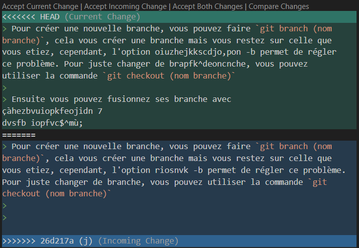

# Applications clientes

## Création d'un dépot git Local

> Ici, nous allons vous faire une démonstration et vous expliquez comment faire un dépot git Local. C'est à dire seulement sur votre ordinateur, et non sur un dépôt Git. Seul vous y aura accés depuis votre ordinateur. 
>
> Après nous ferons l'exemple avec un Git distant qui permet de partager votre code avec d'autres personnes.

### Compte utilisateur

> Pour commencer, vous devez **créer un compte**. Pour cela il vous suffit de faire ses 3 commandes dans l'ordre en remplaçant votre Prénom, votre nom et votre addresse mail.
```
git config --global user.name "Prénom Nom" 
git config --global user.email "votre@email" 
git config --global init.defaultBranch "master"
```

> Les 2 premières lignes de commandes servent a créer votre compte. La dernière sert à nommé votre [branche principale](#expliquez-la-différence-entre-un-commit-une-branche-et-un-tag).

### Création d'un dépot git et gestion de la zone de staging

> Pour créer un dépot git, mettez vous dans le dossier dans lequel vous voulez créer votre dépot git et entrez la commande `git init`. Vous pouvez aussi aller voir [ici] (#créez-un-nouveau-dépôt-git-local-quelle-commande-utilisez-vous--que-se-passe-t-il-) pour avoir plus d'explication.  
>
> Ensuite pour la gestion de la zone de staging (l'endroit où sont mis vos fichier et dossiers avant d'etre commit, seul vous pouvez voir ses fichiers) des fichiers, ou des dossiers, vous pouvez soit faire `git add .` qui va vous ajoutez tout vos fichiers **depuis le répertoire ou vous etes**, 

::: note
Le répertoire courant, c'est que si vous avez créer un dépot git dans un dossier qu'on va appelé A, que dans celuis-ci vous ajoutez un fichier A1 et un dossier B dont vous y incluez un fichier B2, voici donc la représentation :
:::

 * A
   * A1
   * B
     * B1

> Si vous faites un `git add .` dans le dossier B, ceci va uniquement ajouter le fichier B1 et non le reste. 
>
> Vous pouvez aussi ajouter un seul fichier en fessant `git add (votre fichier)`.
>
> Vous pouvez aussi retirer des fichiers et des dossiers mais cela est un petit peu complexe. Ne vous inquituetez pas, nous allons vous expliquer.
>
> Vous pouvez faire `git rm --cached (votre fichier)` pour retirer un fichier. Le rm pour remove et le --cached pour qu'il soit supprimer uniquement de la **zone de staging**.
>
> Si vous avez des dossiers soit vous voulez supprimer tout ce qu'il y a à l'intérieur et donc vous faites `git rm -r --cached (votre dossier)`. Le `-r` pour récirsif et va donc s'appliquer au dossier et ce qu'il contient.
>
> Et si vous voulez atout enlever, vous pouvez faire `git rm -r --cached .`. Le `-r`est obligatoire même si vous n'avez pas de dossier.
>
> Vous pouvez aussi voir vos fichers/dossiers qui sont dans la zone de staging en fessant un `git status`, voici un exemple :

```
robin@Rob1:/mnt/c/Users/aerno/Desktop/testdepot/f2$ git status
On branch master

No commits yet

Changes to be committed:
  (use "git rm --cached <file>..." to unstage)
        new file:   f2

Untracked files:
  (use "git add <file>..." to include in what will be committed)       
        ../f1
```

> Vous pouvez voir sur qu'elle branche vous etes, les commit effectué ainsi que les fichiers/dossiers qui sont dans votre zone de staging.

### Git commit

> La commande git commit permet d’enregistrer les fichiers ajoutés à la zone de staging dans l’historique local de Git. vous pouvez faire un [`git commit -m "(votre message)"`](#expliquez-la-différence-entre-un-commit-une-branche-et-un-tag). le `-m "(votre message)"` sert à mettre un mesage en meme temps que le commit afin d'avoir un moyen de savoir ce que le commit a changé pour vous, et pour les autres et d'avoir une histroique clair.
>
> Vous pouvez utilier `git log` afin de voir les différent commit effectuer qui comprend la branche sur laquelle vous avez effectuer le commit, la date, l'auteur et le message du commit.

```
commit aaa61cdde660866741830bf647d1feefd589e545 (HEAD -> master)
Author: Robin Aernout <robinaernout@gmail.com>
Date:   Fri Mar 27 20:18:38 2026 +0100

    p

commit 6ec5ec48a6eee09aca9786a20294467850b865cb
Author: Robin Aernout <robinaernout@gmail.com>
Date:   Fri Mar 27 20:17:50 2026 +0100

    o

commit 008f27c9921a6cc4c30c52076d06902f8cd936dd
Author: Robin Aernout <robinaernout@gmail.com>
Date:   Fri Mar 27 18:20:15 2026 +0100

    m
```

> Comme sur cette exemple, chaque commit à un identifiant unique, l'auteur qui correspond au 3 lignes de codes du début, ainsi que la date exacte.

### Les branches

> Ici nous allons faire une nouvelle branche puis la fusionner avec la branche principale tout en vous explicant ce processus
>
> Pour créer une nouvelle branche, vous pouvez faire `git branch (nom branche)`, cela vous créer une branche mais vous restez sur celle que vous etiez, cependant, l'option riosnvk -b permet de régler ce problème. Pour juste changer de branche, vous pouvez utiliser la commande `git checkout (nom branche)`
>
> Vous pouvez aussi supprimer une branche avec `git branch -d (nom brache)`
> 
> Ensuite vous pouvez fusionnez ses branche avec `git merge (nom branche). Vous devez vous mettre sur la branche sur laquelle vous voulez qu'elle reste. Cependant parfois il peux y avoir un conflit comme sur cette image
>
> 
>
> Cela arrivent quand deux versions d’un même fichier (ou même ligne) ont été modifiées différemment et que Git ne sait pas laquelle choisir automatiquement.
>
> Quand cela arrivee, vous etes placé dans un dépôt dans un état temporaire le temps que vous régler ce conflit.
>
> Pour régler ce conflit vous avez plusieurs manière. Juste au dessus du conflit vous avez 4 choix. **Accept Current Change** permet de garder la version locale, **Accpet Incoming Change** de garder la version de l'autre branche, **Accept Both Changes** conserve les deux modifications et seront mises à la suite puis **Compare Changes** pour voir les différences côte a côte.
>
> Après avoir fait votre choix, vous pouvez faire un git add puis un commit puis vous pouvez retourner sur votre branche (`git checkout (nom branche)`) et voila le conflits terminer.

## Dépôt privé GitLab

> Nous allons dans cette partie faire un dépôt privé sur le GitLab de notre université. Nous allons cloner le dépot puis on va chacun créer une branche, push un fichier puis fusionnez les branches dans la branche principale.
>
> Ceci a pour objectif de vous montrez comment travailler en équipe.

### Créer un dépôt privée sur GitLab

#### Création du dépot

> Premièrement, connecter vous sur GitLab, cliquer sur le + en haut à droite puis sur New project/repository, Create blank project. 
>
> Vous arriverez sur une page où il faut créer un nouveau projet. Entrer le nom de votre projet dans Project name et dans Project URL metter vos utilisateurs. La case Project slug sert à mettre le nom du dossier dans lequel votre Git sera, il se rempli automatiquement avec le nom de votre projet si rien y est mit. 
>
> Par défault,  votre Git est en priver est comprant un README, cependant, vous pouvez bien sur le changer.
>
> Pour finir cliquer sur create project. Voici votre Git prêt à l'emploi
>
> Pour cloner votre Git, et donc le mettre sur votre ordinateur dans un dossier vous avez 2 possibilité. Soit par clé HTTPS, donc vous devrez à chaque commit entrer vos nom d'utilisateur et votre MDP, ou par clé SSH qui permet de ne pas devoir entrer vos informations à chaque commit, mais est un peu plus long à mettre en place.

#### Création clé SSH

> Nous allons ici le faire par clé SSH. Nous allons donc vous donnez les différentes étapes a suivre.
>
> Tout d'abord, générer une clé ssh en fessant la commande `ssh-keygen -t ed25519`. 
>
> Ils vous demanderont ensuite `Enter file in which to save the key.
>
> Ensuite ils vous demanderont aussi `Enter passphrase`, cela sert a **mettre un MDP** pour votre clé, donc à chaque utilisation de celle-ci, vous devrez entrer ce MDP.
>
> Voila, votre clé est générer, nous pouvons maintenant prendre son contenu avec la commande `cat ~/.ssh/id_ed25519.pub` et en faire un copier coller puis l'**insérer** dans GitLab.

::: tip
Si vous ne vous souvenez plus du nom de votre clé, vous pouvez faire `ls ~/.ssh/`
:::

> Pour cela appuiez sur le menu en haut à gauche et aller dans l'onglet **SSH Keys**. Appuiyez ensuite sur **Add new key**
>
> Vous pouvez ici entrer ce que vous aviez copier. Vous pouvez aussi changer son type d'utilisation et sa date d'expiration.
>
> Cependant ne changez pas le titre, sinon votre clé ne va pas marcher. 
>
> Voila votre clé ssh est prête a l'emploi.


#### Git clone

> Maintenant que votre clé ssh est prête a l'emploi, vous pouvez maintenant mettre le Git sur votre ordinateur.
>
> Pour cela, retourner sur votre projet, appuiyez sur code, puis copier la case **Clone with SSH**
>
> Retourner dans votre terminale, puis faites `git clone (coller)`
>
> Voila, votre Git est maitenant prêt à l'utilisation.

#### Partage du Git

> Pour partager votre git, ils vous suffit tout simplement d'aller dnas la barre de recherche tout en haut et de cliquer sur votre projet.
>
> Ouvrez le menu puis cliquez sur Manage -> Membre.
>
> Cliquez sur Invite members puis inviter vos membres.
>
> Ensuite vous pouvez leur transmettre le votre projet en leur envoyant le lien du git clone avec SSH ou avec HTTPS.

#### Création des branches

> Pour ce qui est des branches, vous pouvez aller voir [ici](#les-branches), c'est la même chose qu'un Git Local pour ce qui est des commandes.

#### Mieux gérer la collaboration avec les branches

> Pour bosser efficacement à plusieurs, on ne se contente pas d'une seule ligne droite. L'idée, c'est de pouvoir créer des "branches" (des versions parallèles du projet) à différents endroits selon les besoins :
>
> - **Créer une branche à partir de l'origine (`main`)** : C'est ce qu'on fait le plus souvent. On crée une branche toute neuve à partir de la version stable du projet pour ajouter une nouvelle fonctionnalité sans rien casser.
> - **Créer une branche à partir d'une autre branche** : Parfois, on a besoin de diviser une grosse tâche en sous-tâches. Par exemple, si l'un de nous travaille sur la "Semaine 4", un autre peut créer une branche à partir de celle-ci pour corriger juste un petit bug spécifique à cette étape sans attendre que tout soit fini.
>
> **Pourquoi on fait ça ?**
>
> Ça nous permet de travailler sur des parties différentes du rapport ou de la conf sans se marcher sur les pieds. Une fois que le travail sur une branche est propre et testé, on le "fusionne" (`merge`) dans la branche principale.

```
robin@Rob1:/mnt/c/Users/aerno/Desktop/ttt/projet-test$ git branch -a
  main
* robin.aernout.etu
  remotes/origin/HEAD -> origin/main
  remotes/origin/main
  remotes/origin/youssef.chekalil.etu
```

> Comme le montre cette exemple, obtenu avec un `git branche -a` on peux faire une branche sur le main (`robin.aernout.etu`) ainsi que sur l'origin (`youssef.cheklil.etu).
>
> Cependant, si vous voulez push, vous devez faire `git push --set-upstream origin (votre branche)`. Sinon votre `git clone` ne marche pas.

## Concept de base

### Quelle est la différence entre Git et les logiciels comme GitHub / GitLab / Forgejo ?

> **Git** est un système de contrôle de version décentralisé qui s'exécute localement sur une machine (installé sur Debian via `sudo apt install git`). Il permet de gérer l'historique des modifications de fichiers de manière autonome. À l'inverse, **GitHub, GitLab et Forgejo** sont des plateformes d'hébergement web. Elles centralisent les dépôts Git sur des serveurs distants pour faciliter le travail collaboratif, la sauvegarde en ligne et la gestion de projet (Merge Requests, Issues). [source](https://www.google.com/search?q=https://git-scm.com/book/fr/v2/D%25C3%25A9marrage-rapide-%25C3%2580-propos-du-contr%25C3%25B4le-de-version)

### Qu’est-ce qu’un dépôt Git ? Où sont stockées les données d’un dépôt local ?

> Un dépôt Git est une structure de données contenant l'intégralité des fichiers d'un projet ainsi que tout l'historique des révisions. Dans un environnement local, ces informations sont stockées dans un répertoire masqué nommé `.git`, situé à la racine du projet. Ce dossier contient la base de données des objets Git et les fichiers de configuration. [source](https://www.geeksforgeeks.org/git/what-is-a-git-repository/)

### Expliquez la différence entre un commit, une branche et un tag

>   * **Le Commit** : Il représente un instantané (snapshot) du projet à un instant précis. Chaque commit possède un identifiant unique (SHA-1) et enregistre les modifications par rapport à l'état précédent.
>   * **La Branche** : Il s'agit d'un pointeur mobile vers un commit. Elle permet de s'isoler de la ligne principale pour développer des fonctionnalités sans risque. Elle avance automatiquement à chaque nouveau commit.
>   * **Le Tag** : C'est un pointeur immuable (fixe). Contrairement à la branche, il ne change jamais de position. On l'utilise généralement pour marquer des versions majeures du projet (ex: v1.0).
>     [source](https://www.google.com/search?q=https://git-scm.com/book/fr/v2/Les-branches-sur-Git-Les-branches-en-quelques-mots)

### Qu’est-ce qu’un dépôt distant (remote) ? Comment lister les remotes configurés ?

> Un dépôt distant est une instance du projet hébergée sur un serveur réseau (ex: GitLab IUT). Il permet la synchronisation du travail entre plusieurs développeurs. Pour visualiser les dépôts distants associés à un projet local, on utilise la commande `git remote -v`. [source](https://git-scm.com/book/fr/v2/Les-bases-de-Git-Travailler-avec-des-d%C3%A9p%C3%B4ts-distants)

### Quelle est la différence entre git pull et git fetch ?

> La commande `git fetch` télécharge les nouveaux objets et références du dépôt distant sans modifier l'état actuel des fichiers locaux. `git pull` est une commande combinée qui effectue un `git fetch` suivi immédiatement d'un `git merge`. [source](https://www.atlassian.com/fr/git/tutorials/syncing/git-pull)

## Protocoles Git

### Quels sont les protocoles supportés par Git pour accéder à un dépôt ?

> Git utilise principalement quatre protocoles de transfert :
>
> 1.  **Local** : Utilisé pour les dépôts situés sur le même système de fichiers ou un disque partagé.
> 2.  **SSH** : Le protocole le plus courant pour l'écriture, utilisant des paires de clés pour une sécurité optimale.
> 3.  **HTTP/HTTPS** : Facile à configurer et capable de traverser la plupart des pare-feux réseau.
> 4.  **Git** : Un protocole dédié, extrêmement rapide pour le téléchargement mais dépourvu d'authentification.
>     [source](https://git-scm.com/book/en/v2/Git-on-the-Server-The-Protocols)

### Sur quels ports réseau fonctionnent ces protocoles ?

| Protocole | Port par défaut | Transport     |
|-----------|-----------------|---------------|
| Local     | -               | -             |
| SSH       | 22              | SSH           |
| HTTP      | 80              | HTTP          |
| HTTPS     | 443             | HTTP sur TLS  |
| Git       | 9418            | Protocole Git |

[source](https://git-scm.com/book/en/v2/Git-on-the-Server-The-Protocols)

### Comment configurer l’authentification SSH pour Git ?

> **1. Génération :** `ssh-keygen -t ed25519` crée une paire de clés. [source](https://www.google.com/search?q=https://docs.gitlab.com/ee/user/ssh.html)
>
> ```
> ssh-keygen -t ed25519
> ```
>
> **2. Lecture :** Extraction via `cat ~/.ssh/id_ed25519.pub`.
>
> **3. Validation :** Test de connexion via `ssh -T git@gitlab.com`.

## Commandes essentielles

### Créez un nouveau dépôt Git local. Quelle commande utilisez-vous ? Que se passe-t-il ?

> L'initialisation se fait via `git init`, ce qui génère le dossier racine `.git` nécessaire au suivi des versions. [source](https://git-scm.com/docs/git-init) 


### Utilisez git diff pour comparer deux commits. Expliquez la sortie.

> La commande `git diff HEAD~1 HEAD` compare l'état du projet entre deux commits(exactement le passage de l'avant-dernier commit au dernier). Les lignes avec `-` indiquent les suppressions et `+` les ajouts. [source](https://git-scm.com/docs/git-diff)

### Qu’est-ce que le fichier .gitignore ?

> **Rôle**
> : Empêcher le suivi de certains fichiers par Git.
> **Utilité**
> : Éviter de versionner des fichiers temporaires, des fichiers de compilation ou des données sensibles.
> **Exemples**
> : Les fichiers `*.class`, `*.jar` ou les répertoires de logs.
> [source](https://git-scm.com/docs/gitignore)

## Collaboration avec Git

### Travail collaboratif en équipe (Merge Request)

> En équipe, nous utilisons des branches dédiées et des **Merge Requests** sur GitLab pour soumettre les modifications à la validation des pairs avant intégration. [se](https://docs.gitlab.com/ee/user/project/merge_requests/)ourc

### Test de la commande git blame

>`git blame` est un outil d'audit permettant d'identifier, pour chaque ligne d'un fichier, le dernier auteur et le commit associé. C'est une commande essentielle pour comprendre l'évolution historique d'un algorithme au sein d'une équipe. [source](https://git-scm.com/docs/git-blame)

## Interfaces graphiques pour Git

### Logiciels par défaut et tiers

> Nous avons utilisé les outils suivants :
>
>   * **gitk** : Pour la visualisation de l'historique et du graphe des branches.
>   * **git-gui** : Pour la gestion simplifiée des index et des commits.
>   * **Git Cola** : Logiciel tiers installé (`sudo apt install git-cola`) pour ses capacités avancées de staging partiel. [source](https://git-cola.github.io/)

## Comparaison et Analyse approfondie

### Pourquoi avez-vous choisi ce logiciel ? (Comparaison des outils graphiques et de la ligne de commande)

> Sur notre système Debian 13, j'ai testé gitk et git-gui. La ligne de commande (CLI) reste mon outil privilégié pour sa rapidité d'exécution et sa capacité à être automatisée par des scripts. Cependant, l'interface graphique (GUI) apporte une clarté visuelle indispensable pour comprendre les fusions de branches complexes ou pour effectuer une sélection précise de lignes lors d'un commit partiel. [source](https://www.atlassian.com/fr/git/tutorials/comparing-workflows)

### Dans un contexte professionnel, quel outil privilégieriez-vous et pourquoi ?

> Dans un contexte professionnel, je privilégierais une approche hybride, mais centrée sur la ligne de commande. Le terminal est universel, fonctionne sur des serveurs distants sans interface graphique et permet une maîtrise totale des actions. J'utiliserais l'outil graphique ponctuellement, principalement comme aide visuelle pour la résolution de conflits de fusion majeurs ou pour la revue rapide d'un historique complexe. [source](https://git-scm.com/downloads/guis)
